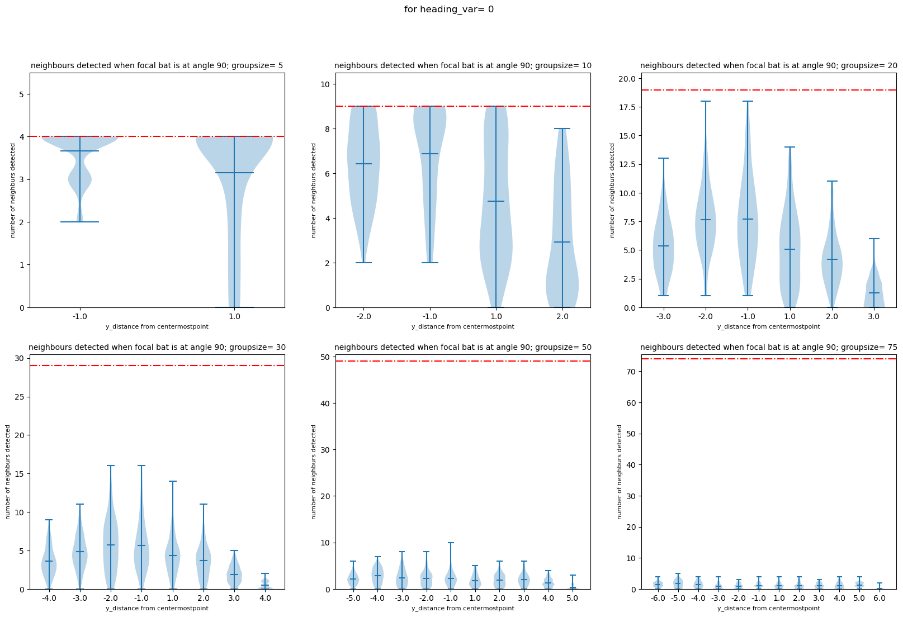

#thesis #report #static_simulation

For implementation refer to [[Effect of radial distance]] and [[Effect of heading variation]]

## Results
- effect on number of neighbours detected.
	- 
	- ![[Pasted image 20250805192351.png]]
	- ![[Pasted image 20250805192400.png]]
	- ![[Pasted image 20250805192407.png]]
	- ![[Pasted image 20250805192418.png]]
	- ![[Pasted image 20250805192425.png]]
	- we expect the plots to be symmetric about d=0 for milling and swarming, the slight differences we see in miilling case 'could' be due to differences in implementation of changing radial distance, which uses the centermost bat as the starting point vs implementation; but the difference might not be that big as small group size isnt relevant anyways.
	- trends in general are not very different but i can plot this better by making a grouped violin plot [MAKE A BETTER PLOT]
- effect on probability
	- ![[Pasted image 20250805180201.png]]
	- ![[Pasted image 20250805180207.png]]
	- ![[Pasted image 20250805180212.png]]
	- ![[Pasted image 20250805180216.png]]
	- ![[Pasted image 20250805180221.png]]
	- ![[Pasted image 20250805180227.png]]
- Effect on Neighbour azimuth
	- ![[Pasted image 20250805173149.png]]
	- ![[Pasted image 20250805173154.png]]
	- ![[Pasted image 20250805173200.png]]
	- ![[Pasted image 20250805173209.png]]
	- ![[Pasted image 20250805173215.png]]
	- ![[Pasted image 20250805173224.png]]
	- all the emergence cases have roughly the same structure in their violin plots. bimodality when at the front of the group vs narrower neighbour detection azimuth at the back of the group. 
	- this changes for swarming as expected; in swarming case the neighbour detection is a random spread over -180 to 180, no directionality of detection at lower group sizes. as group sizes increase, neighbour detection angles bias to the front of the bat increases; i.e. bats detect individuals to the front of them more often than the ones behind them which makes intuitive sense.
	- because our milling case is anticlockwise, at low group sizes are biased to the left of the bat, where other bats are. the mean of neighbour detection moves towards zero as group size increases which suggests that when neighbour detection is bad (due to poor echo/masker ratio) you are more likely to detect neighbours in front of you that anywhere else. There is a shift to mean being above zero at higher group sizes in cases where the bats are not at the edge of the group; and this is because of spatial unmasking!
- effect on received sound levels
	- ![[Pasted image 20250805175212.png]]
	- ![[Pasted image 20250805175217.png]]
	- ![[Pasted image 20250805175223.png]]
	- ![[Pasted image 20250805175227.png]]
	- ![[Pasted image 20250805175232.png]]
	- ![[Pasted image 20250805175238.png]]
	- [need to properly think about these results]
	- the general trend of, at larger group sizes the echoes heard are echoes that bounce off of the closest neighbours and are hence louder. 
	- more detailed trends need to be looked at along with what happens when Direct sound is also taken into account.